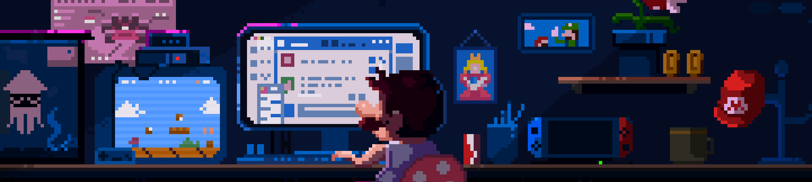

 

<h1 align="center">Hello World!👋, I'm Ayushman Bhatnagar</h1>
<h3 align="center">🚀 Crafting Projects that Solve Problems | Web Development Enthusiast</h3>

## ✨ About me:
- 🌱 I’m currently learning **GenAI, ML** 

- 💬 Ask me about **Web Development**

- 📫 How to reach me **ayushbhat0518@gmail.com**

- 💪 Looking to collaborate on **Projects**

## 💻 Tech Stack:
                
